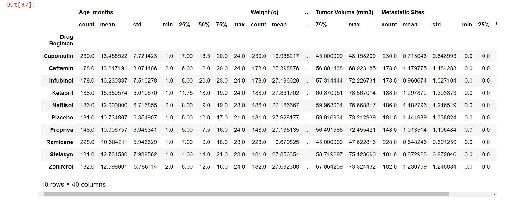
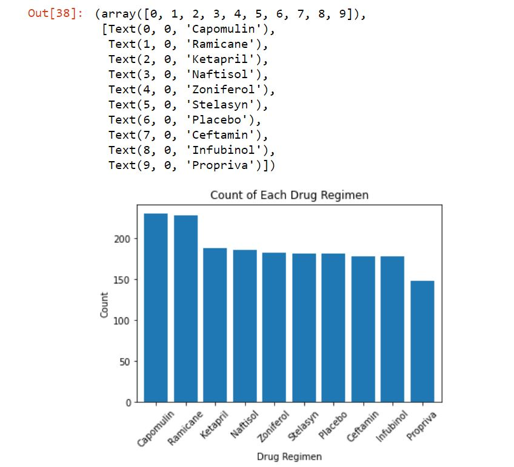
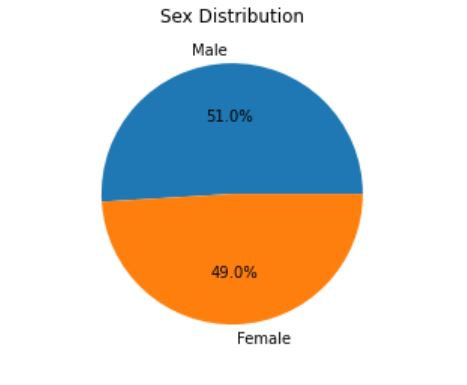
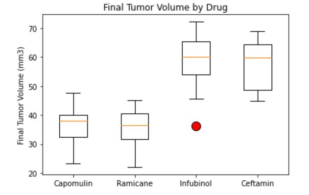
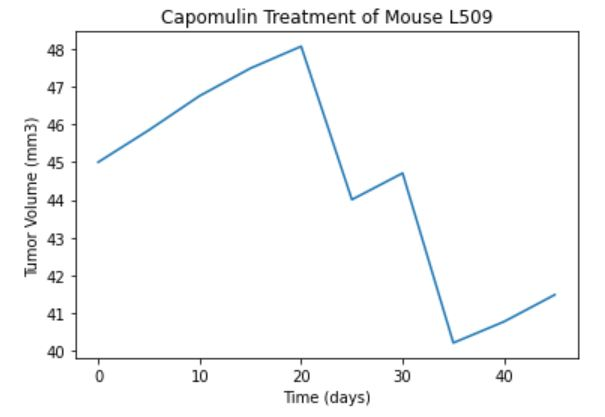
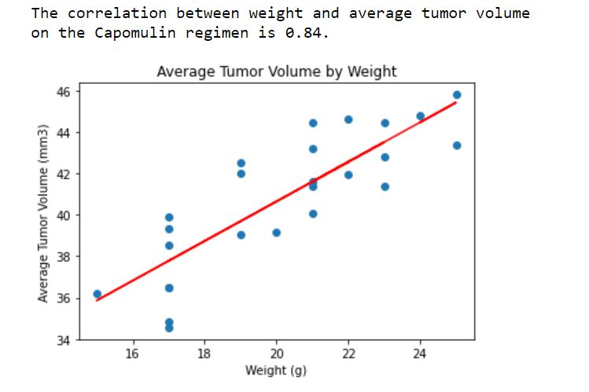

# matplotlib-challenge

Used pandas  to merge [mouse data](data/Mouse_metadata.csv) and [study results](data/Study_results.csv).
Performed data cleaning by removing duplicate data points. Utilized groupby function to aggregate statistical summary for the different drug regimens.

Used matplotlib to visualize the summary of the study.
Set ticks at a 45 degree angle for ease of viewing.

Used a pie chart to visualize the distribution of Sex among lab mice.
Made sure the format of percentage is easy to read. Added labels so chart is clear and concise at first glance.

Used a box and whisker plot to show outliers within the dataset.
Indictate the marker value in red.

Used a line plot to graph times series data.

Used a scatter plot to show distribution of dataset. Used a red line to demonstrate the simple regression line.

